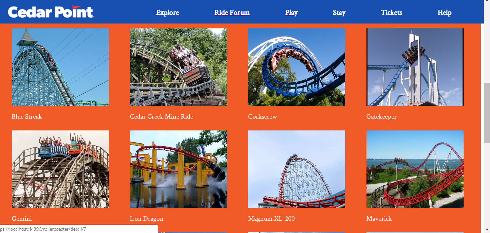

# Coaster Project Application
Side Project during Tech Elevator

## Functionality
* User can see a displayed view of roller coasters and click on an item to get a further displayed page
* Through the navigaton bar the user can post to a forum, rate rides and comment on it

## Screenshots
* Tile view of the roller coasters at Cedar Point

## Languages and Tech Used
* [C#](https://docs.microsoft.com/en-us/dotnet/csharp/)
* [HTML](https://developer.mozilla.org/en-US/docs/Web/HTML)
* [CSS](https://developer.mozilla.org/en-US/docs/Web/CSS)
* [Visual Studio 2017](https://visualstudio.microsoft.com/vs/whatsnew/)
* [SSMS](https://docs.microsoft.com/en-us/sql/ssms/sql-server-management-studio-ssms?view=sql-server-2017)
* [SQL](https://docs.microsoft.com/en-us/sql/?view=sql-server-2017)
* [Razor](https://docs.microsoft.com/en-us/aspnet/core/mvc/views/razor?view=aspnetcore-2.2)

## Features to Come
* User can add rides they have ridden to their own ride tracker
* Make the unclickable links clickable and add content to those views
* Add JavaScript to the page to add fun behavior
* Sign-in feature
